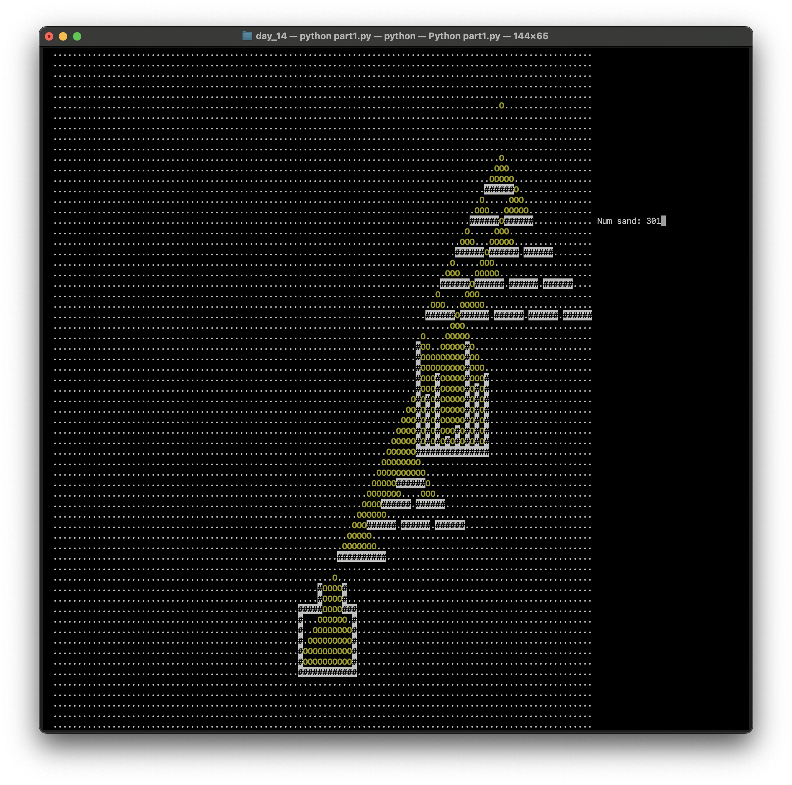

## Advent of Code

My solutions to the [Advent of Code](https://adventofcode.com/) puzzles.

[I learned about Advent of Code in December 2023](https://www.unicornds.org/why-data-scientists-should-try-advent-of-code/) while at [Recurse Center](https://www.recurse.com/). Now I'm a huge fan. I've also started to work on puzzles from earlier years.

Here are some visualizations.

## 2024 Day 14: Restroom Redoubt

## 2023 Day 18: Lavaduct Ladgoon

[https://adventofcode.com/2023/day/18](https://adventofcode.com/2023/day/18)

## 2022 Day 14: Regolith Reservoir

[https://adventofcode.com/2022/day/14](https://adventofcode.com/2022/day/14)

https://github.com/jovisly/AoC-2023/assets/99686932/fca9b110-9088-46e2-86af-4654675b0499

https://github.com/jovisly/AoC-2023/assets/99686932/03b0aed5-b900-4ba9-870d-2e5cdcc4a32e

## 2022 Day 12: Hill Climbing Algorithm

[https://adventofcode.com/2022/day/12](https://adventofcode.com/2022/day/12)

## 2022 Day 9: Rope Bridge

[https://adventofcode.com/2022/day/9](https://adventofcode.com/2022/day/9)

https://github.com/jovisly/AoC-2023/assets/99686932/1d48aa87-b783-436a-84e2-c788c3e165d7
